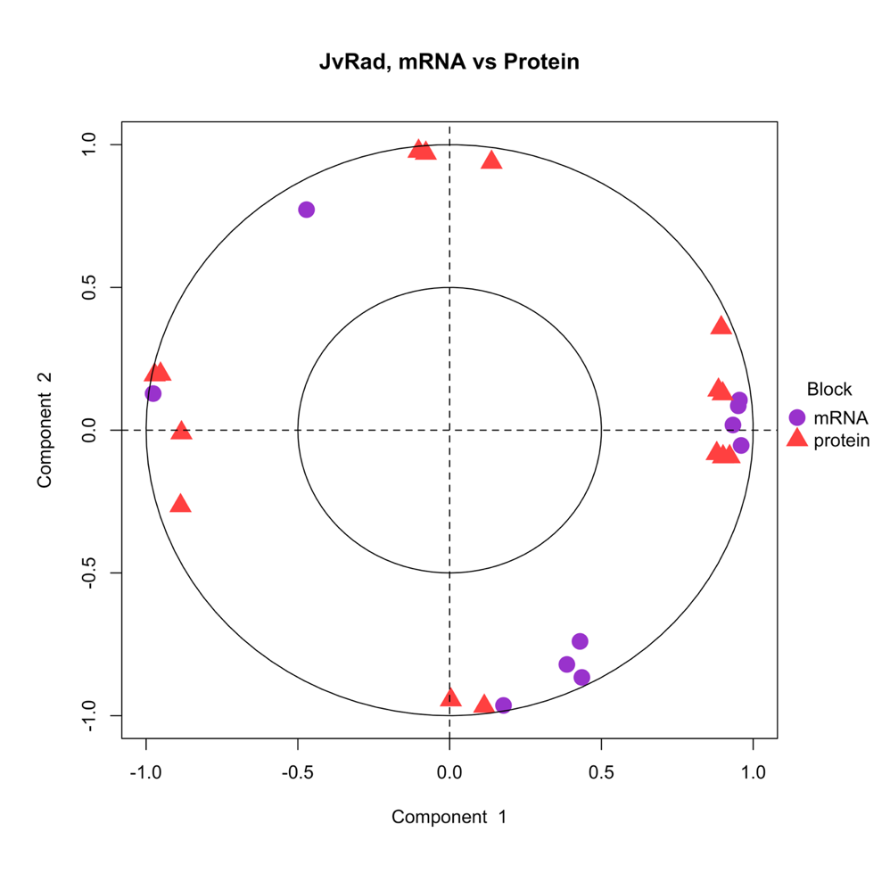
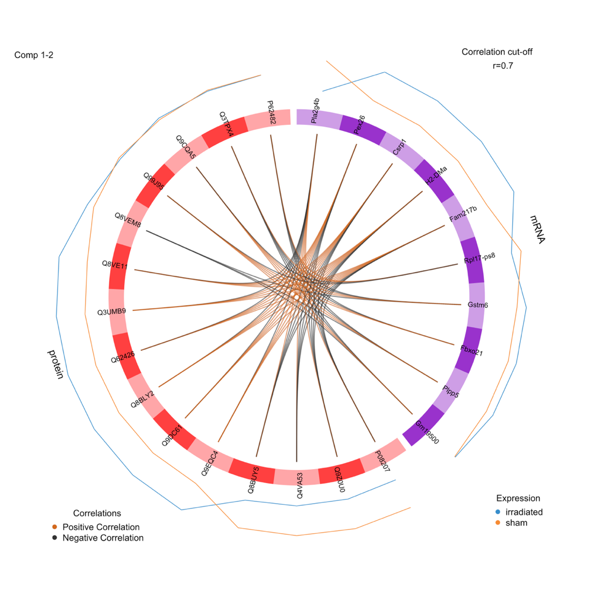

# Integrated Proteomics + RNA-seq (mixOmics)

## Study Objective
- Integrate transcriptome and proteome readouts to pinpoint convergent pathways driving irradiation-induced cognitive deficits and SFN responses.

## Methods
- Data sources: RNA-seq (Aim I/II) and TMT proteomics datasets from the same hippocampal cohorts.
- Integration toolkit: `mixOmics` (correlation circle plot, Circos plot) for multi-block association.
- Supplementary: pathway summaries from FGSEA/IPA to interpret joint signatures.

## Key Plots
- Correlation circle (mRNA–protein concordance): 
- Circos plot linking transcript–protein pairs: 

## Approach
- Pre-filter to genes/proteins with reliable measurements, then scale/center for cross-omics correlation.
- Visualize mRNA–protein concordance (correlation circle, Circos).
- Use joint features to nominate pathway-level drivers and therapeutic targets.

## Key Findings & Limits
- Strongest signals highlighted neuroinflammation, mitochondrial dysfunction, and synaptic disruption; targets such as **CREB** and **PSEN1** surfaced as candidates.
- Integration was constrained by few differentially expressed proteins and weak mRNA–protein correlations, limiting model robustness within `mixOmics`.
- Despite limitations, combined evidence supports irradiation-induced neuronal/synaptic signaling damage and inflammatory activation.

## Artifacts
- Correlation circle plot and Circos mRNA–protein concordance visualizations.
- Summary slide: irradiation (10 Gy) caused cognitive deficits; multi-omics integration contextualized molecular disruptions.
