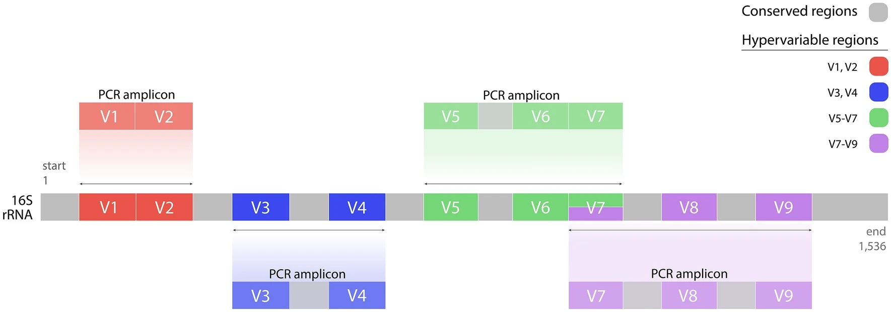

# Microbiome (QIIME2, 16S V3–V4)

## Study Objective
- Aim III: Test whether an SFN diet mitigates vincristine–methotrexate–leucovorin chemotherapy effects on cognition, intestinal morphology, and gut microbiota in male mice.

## Methods
- 16S rRNA gene sequencing targeting V3–V4 hypervariable region (culture-independent, genus-level profiling; positioning based on *E. coli* 16S reference).
- Processing/analysis with QIIME2 workflow.
- Context slides summarize microbiome role in metabolism, immunity, and brain function; dysbiosis linked to inflammation and cognitive dysfunction.

## Key Plots
- V3–V4 hypervariable region schematic: 
- QIIME2 analysis workflow: 

## Approach
- Compare chemo-only vs chemo+SFN groups for microbial composition, diversity, and downstream intestinal morphology.
- Use QIIME2 for demultiplexing, denoising, taxonomy assignment, and differential abundance; integrate behavioral readouts (days 3–5 memory performance).

## Key Results & Interpretation
- SFN did not alter food intake or body weight post-chemotherapy.
- Chemo-only group exhibited memory deficits on days 3–5; SFN did not rescue behavior.
- Gut microbiome composition showed no significant SFN-driven shifts relative to chemo-only.
- Intestinal crypt and villus morphology remained similar between chemo-only and chemo+SFN groups.

## Artifacts
- QIIME2 analysis workflow diagram and V3–V4 region schematic.
- Summary slide outlining behavioral and microbiome outcomes.
