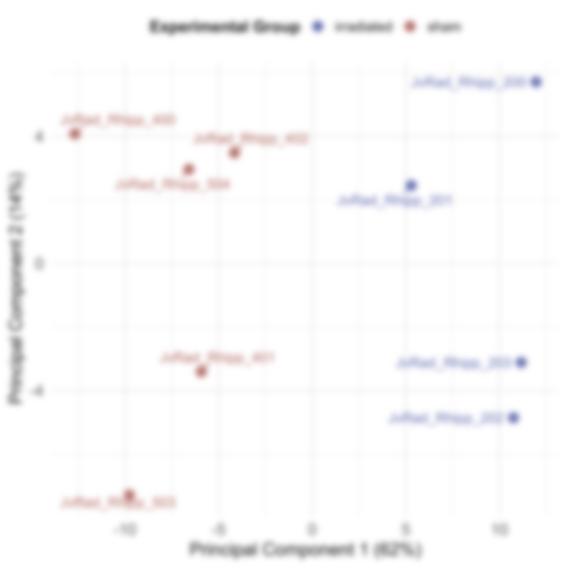
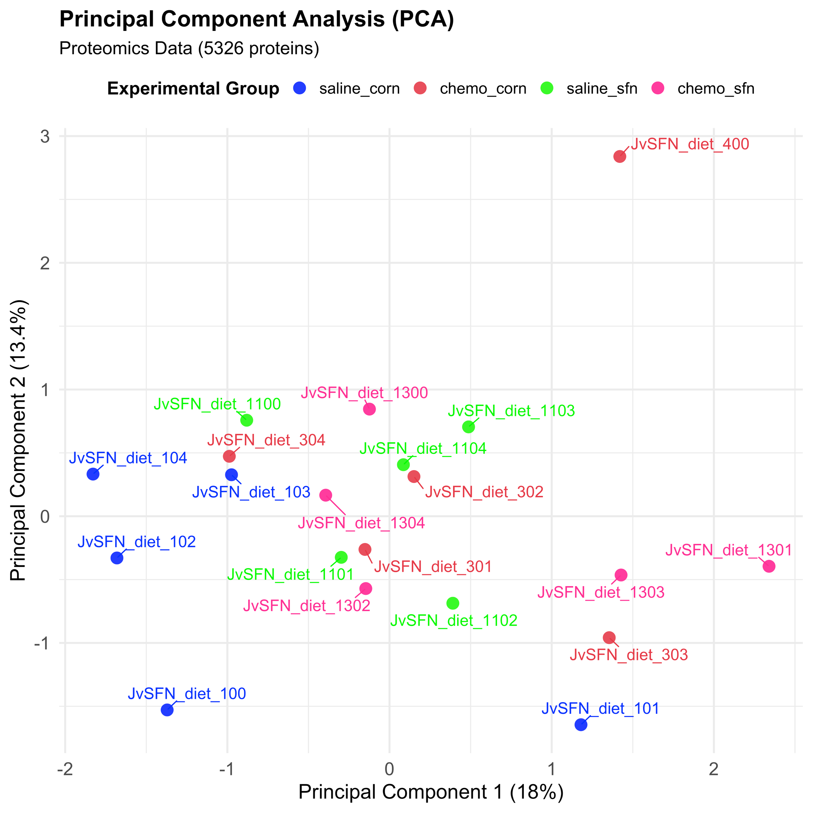

# Proteomics (TMT-MS)

## Study Objective
- Quantify hippocampal protein changes after cranial irradiation and assess long-term modulation by sulforaphane (SFN).

## Methods
- Upstream: tissue processing with TMT-10plex labeling; Orbitrap Eclipse MS acquisition via UAMS Proteomics Core.
- Identification/quantification: MaxQuant.
- QC/Preprocessing: variance-stabilizing normalization (VSN); missing values imputed with MinProb.
- Differential expression: significance cutoffs log2FC ≥ 1.5 and adjusted p ≤ 0.05.
- Functional analysis: FGSEA for pathway discovery; QIAGEN IPA for upstream regulators/network modeling.

## Approach
- Contrast irradiated vs control (± SFN) proteomes; visualize with PCA (JvRad study, Aim I).
- Filter proteins passing QC, then apply DEP pipeline thresholds for differential abundance.
- Map significant proteins to pathways/regulators for mechanistic hypotheses.

## Key Results & Interpretation
- PCA separated treatment groups, indicating irradiation-driven proteome shifts.
- Differential proteins linked to neuronal signaling, synaptic function, and inflammation (aligned with RNA-seq findings).
- Candidate therapeutic nodes emerging from IPA/FGSEA analyses will inform validation experiments.

## Key Plots
- PCA (JvRad Aim I proteome): 
- Additional protein-level view (TMT set): 

## Artifacts
- PCA plot (JvRad Aim I).
- DEP outputs (normalized intensities, imputed matrix, differential tables) and IPA/FGSEA summaries.
