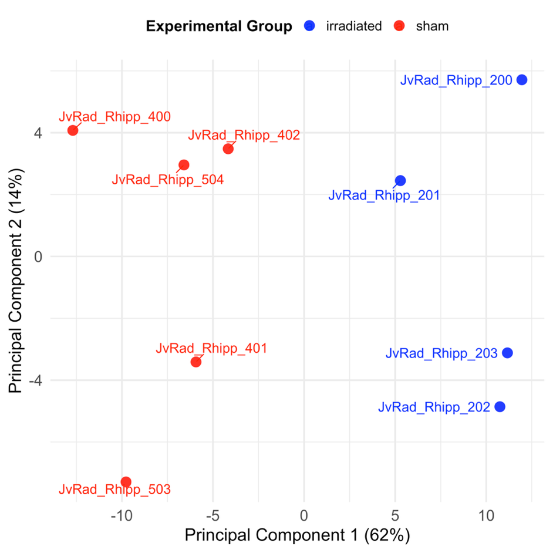
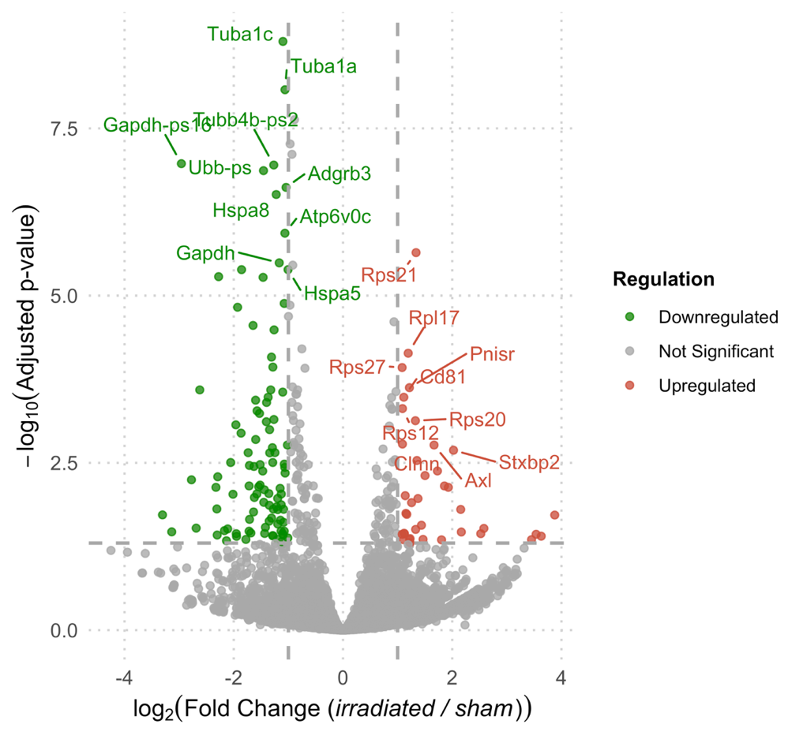
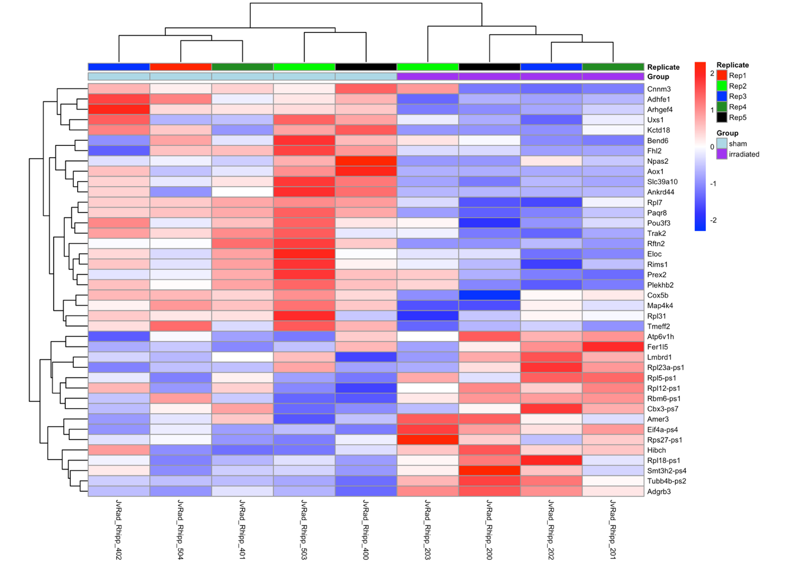

# Transcriptomics (RNA-seq)

## Study Objective
- Determine how cranial irradiation impacts hippocampal-dependent cognition in juvenile mice and whether sulforaphane (SFN) mitigates those effects (Aim I/II).

## Methods
- Library prep and alignment via `nf-core/rnaseq` standard workflow.
- Quality/QC: PCA on top 500 most variable genes separated treatment groups.
- Differential expression: visualized with volcano plot; top 40 DEGs summarized in a heatmap.

## Key Plots
- PCA of top 500 variable genes: 
- Volcano plot highlighting DEGs: 
- Heatmap of top 40 DEGs: 

## Approach
- Compare irradiated vs control (and SFN-treated) hippocampal samples.
- Inspect PCA clustering for batch/treatment effects, then rank genes by variance and significance.
- Prioritize mitochondria- and synapse-related genes highlighted in the heatmap.

## Key Results & Interpretation
- Standout genes: **Atp6v1h**, **Fer1l5**, **Hibch** (mitochondrial/metabolic roles); **Nfkbie** upregulated; **TTN** and **SLC39A6** downregulated.
- Pathways disrupted: neuronal signaling, synaptic function, and inflammatory pathways; consistent with irradiation-induced cognitive deficits.
- 10 Gy cranial irradiation produced measurable cognitive impairment; SFN tested as a potential modulator (see integrated and microbiome projects for downstream effects).

## Links/Artifacts
- Pipeline reference: https://github.com/nf-core/rnaseq
- Plots: PCA (top 500 genes), volcano plot, and heatmap of top 40 DEGs (from dissertation slides).
